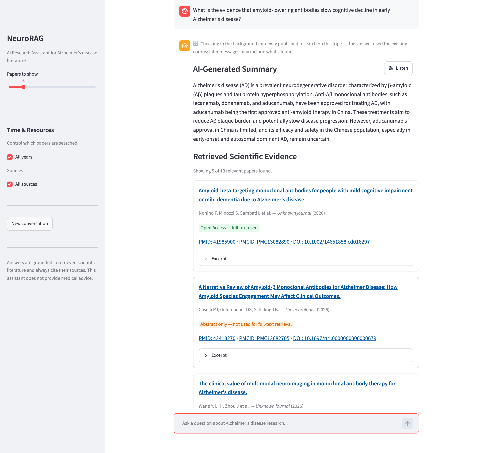

# NeuroRAG — Alzheimer's Disease Research Assistant

[](https://github.com/ArezoShakeri/neurorag/actions/workflows/tests.yml)


An open-source AI Research Assistant for Alzheimer's disease literature. Ask a research
question and get a plain-language, evidence-based answer grounded in retrieved scientific
papers — every claim is cited back to a real source, with full publication metadata and links.

Built for both general-audience users and domain experts/researchers.



## Highlights

- **Agentic RAG with LangGraph** — intent routing (research / about-the-assistant / off-topic),
  retrieval, relevance grading, synthesis, and citation validation as explicit graph nodes.
- **Hallucination-resistant citations** — every cited source is checked *in code* against the
  retrieved set; invalid citations trigger a corrective retry and are stripped if still wrong.
- **Biomedical literature pipeline** — PubMed, PubMed Central, Europe PMC, Crossref and
  Unpaywall clients with deduplication, open-access resolution and section-aware chunking.
- **Always up to date** — the first message of each conversation triggers a background refresh
  that ingests papers published up to today.
- **Domain embeddings** — `S-PubMedBert-MS-MARCO` embeddings in ChromaDB, with source and
  publication-year filters.
- **Runs fully local and free** — Ollama (`qwen2.5:7b-instruct`) by default; switch to Claude via
  one environment variable. Local Whisper voice input and browser read-aloud.
- **Production structure** — FastAPI backend, Streamlit frontend, Docker Compose, typed Pydantic
  schemas shared across ingestion and API, unit tests and CI.

## Tech stack

Python · LangGraph · LangChain · FastAPI · Streamlit · ChromaDB · sentence-transformers ·
Ollama / Anthropic Claude · faster-whisper · Docker · pytest · GitHub Actions

## Quick start

See [docs/setup.md](docs/setup.md) for full setup instructions. Short version:

```bash
python3 -m venv .venv && source .venv/bin/activate
pip install -e ".[dev]"
cp .env.example .env   # fill in UNPAYWALL_EMAIL / CONTACT_EMAIL with a real address

# Local LLM (one-time)
ollama pull qwen2.5:7b-instruct

# Populate the vector store (one-time, ~10-20 min)
python -m rag.run_ingestion

# Run the app (two terminals)
uvicorn backend.main:app --reload
streamlit run frontend/app.py
```

Then open http://localhost:8501.

## How it works

See [docs/architecture.md](docs/architecture.md) for the full design. In short: an offline
ingestion pipeline (`retrieval/` → `rag/` → `database/`) populates a local ChromaDB corpus from
PubMed, PubMed Central, Europe PMC, and other open-access Alzheimer's literature. At query time,
a LangGraph agent (`agent/`) first decides what kind of question this is — about the assistant
itself, Alzheimer's/dementia/MCI research, or off-topic — and answers accordingly: research
questions get papers retrieved and a citation-validated, evidence-grounded answer (citations are
checked in code against what was actually retrieved, so the assistant cannot present a fabricated
reference as real); the first message of a new conversation also triggers a live refresh so
answers reflect papers published up to today. Every answer closes with a confirmation check and
suggested follow-up questions rather than asking for clarification before answering.

Also supports voice input (local, on-device speech-to-text) and read-aloud answers, and sidebar
controls to restrict which sources/publication years get searched.

## Project layout

| Directory | Purpose |
|---|---|
| `retrieval/` | PubMed / PMC / Europe PMC / Crossref / Unpaywall API clients |
| `rag/` | Dedup, OA resolution, chunking, ingestion pipeline, and the per-conversation live refresh |
| `database/` | Chroma vector store, embedding model, shared metadata schema |
| `agent/` | LangGraph agent (classify intent → retrieve → grade → synthesize → validate → format → suggest follow-ups) |
| `prompts/` | LLM prompt templates |
| `backend/` | FastAPI service (query + voice transcription) |
| `frontend/` | Streamlit chat UI (text, voice, read-aloud, resource filters) |
| `workflows/` | Plain-English recipes for the ingestion and query flows |
| `docs/` | Architecture and setup documentation |

## Running with Docker

```bash
cp .env.example .env
docker compose up --build
```

Ollama runs natively on the host (see [docs/setup.md](docs/setup.md)); the vector store is
mounted from `database/chroma_store/`, so run the ingestion step first.

## Tests

```bash
pytest
```

Offline unit tests covering chunking, deduplication, the metadata schema, answer synthesis and
citation validation — no network or LLM required.

## Disclaimer

NeuroRAG is a research and educational tool. It summarizes published literature and is **not**
a source of medical advice, diagnosis or treatment. Always consult the cited papers and a
qualified healthcare professional.

## License

[MIT](LICENSE) © Arezo Shakeri

